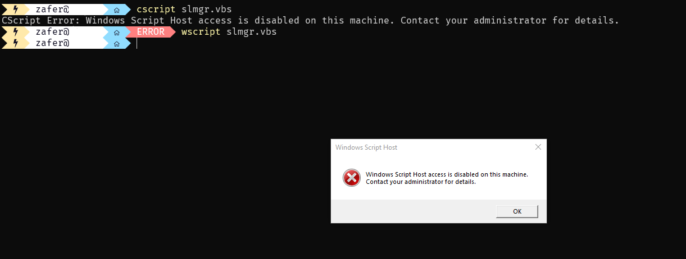
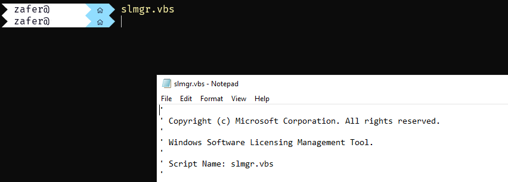

# slmgr-ps

A drop in replacement for slmgr script

**NB:** Currently the features are limited to KMS scenarios. See [Comparison](#comparison) for details.

## Usage

### Installation

```powershell
Install-Module slmgr-ps
```

### `Start-WindowsActivation` cmdlet
```powershell
Start-WindowsActivation -WhatIf

# Activates the local computer
Start-WindowsActivation -Verbose

# Activates the computer named WS01
Start-WindowsActivation -Computer WS01

# Activates the computer named WS01 using different credentials
Start-WindowsActivation -Computer WS01 -Credentials (Get-Credential)

# Disabled the KMS cache for the computers named WS01 and WS02. Cache is enabled by default.
Start-WindowsActivation -Computer WS01, WS02 -CacheEnabled $false

# Activates the computer named WS01 against server.domain.net:2500
Start-WindowsActivation -Computer WS01 -KMSServerFQDN server.domain.net -KMSServerPort 2500

# ReArm the trial period. ReArming already licensed devices can break current license issues.
# Guard clauses wil protect 99% but cannot guarantee 100%.
Start-WindowsActivation -ReArm
```

### `Get-WindowsActivation` cmdlet
```powershell
# Collects basic license information of local computer, equal to slmgr.vbs /dli
Get-WindowsActivation

# Collects extended license information of local computer, equal to slmgr.vbs /dlv
Get-WindowsActivation -Extended

# Collects license expiration information of local computer, equal to slmgr.vbs /xpr
Get-WindowsActivation -Expiry

# Collects basic license information of computer WS01 over WinRM
Get-WindowsActivation -Computer WS01

# Collects basic license information of computer WS01 over WinRM using different credentials
Get-WindowsActivation -Computer WS01 -Credentials (Get-Credential)

```

## About this module

One of my hardening guideline is getting rid of vbscript in every environment.
- I disabled `wscript` and `cscript` executables.


- I changed the file-type association of `.vbs` to be opened with Notepad, and cannot be executed.


This caused me being unable to use `slmgr.vbs`, `OSPP.vbs`, some SCCM features like MDT. I started with `slmgr.vbs` as it was more important for me; I was migrating Windows 7 devices to Windows 10!

I wrote a PowerShell script based on the `slmgr.vbs`. It's long but easy to read. You can find the old script in [my gists](https://gist.github.com/zbalkan/4ba92656a3a8387e6b220bcf8fcd5fc6).

I converted this simple, one-cmdlet script to a module and published it so anyone can use it easily.

### Comparison

| slmgr slmgr.vbs                       | slmgr-ps   | Notes |
|---------------------------------------|------------|-------|
| slmgr machinename                     | -Computers                                                                      | Instead of one, you can provide multiple computer names. |
| slmgr username                        | -Credentials                                                                    | The command uses the current user's credentials. User can passs a credential object. Reference: CWE-214: Invocation of Process Using Visible Sensitive Information |
| slmgr password                        | -Credentials                                                                    | The command uses the current user's credentials. User can passs a credential object. Reference: CWE-214: Invocation of Process Using Visible Sensitive Information |
| slmgr /ipk zfgwx-zvc9b-646c9-t64zx    | Start-WindowsActivation                                                         | No need for KMS keys |
| slmgr /ato                            | Start-WindowsActivation                                                         | no need for calling /ato separately |
| slmgr /rearm                          | Start-WindowsActivation -Rearm                                                  | |
| slmgr /dli                            | Get-WindowsActivation                                                           | |
| slmgr /dlv                            | Get-WindowsActivation -Extended                                                 | |
| slmgr /xpr                            | Get-WindowsActivation -Expiry                                                   | |
| slmgr /ckhc                           | Start-WindowsActivation -CacheEnabled $false                                    | |
| slmgr /skhc                           | Start-WindowsActivation -CacheEnabled $true                                     | KMS cache is enabled by default |
| slmgr /skms activationservername:port | Start-WindowsActivation -KMSServerFQDN activationservername -KMSServerPort port | |
| slmgr /ad                             | not implemented                                                                 | |
| slmgr /ad                             | not implemented                                                                 | |
| slmgr /ao                             | not implemented                                                                 | |
| slmgr /del                            | not implemented                                                                 | |
| slmgr /atp                            | not implemented                                                                 | |
| slmgr /skms-domain                    | not implemented                                                                 | |
| slmgr /ckms                           | not implemented                                                                 | |
| slmgr /ckms                           | not implemented                                                                 | |
| slmgr /cpky                           | not implemented                                                                 | |
| slmgr /dti                            | not implemented                                                                 | |
| slmgr /ilc                            | not implemented                                                                 | |
| slmgr /rilc                           | not implemented                                                                 | |
| slmgr /rearm-app                      | not implemented                                                                 | |
| slmgr /rearm-sku                      | not implemented                                                                 | |
| slmgr /sai                            | not implemented                                                                 | |
| slmgr /sri                            | not implemented                                                                 | |
| slmgr /spri                           | not implemented                                                                 | |
| slmgr /cpri                           | not implemented                                                                 | |
| slmgr /sprt                           | not implemented                                                                 | |
| slmgr /sdns                           | not implemented                                                                 | |
| slmgr /cdns                           | not implemented                                                                 | |
| slmgr /upk                            | not implemented                                                                 | |
| slmgr /lil                            | not implemented                                                                 | |
| slmgr /ril                            | not implemented                                                                 | |
| slmgr /stao                           | not implemented                                                                 | |
| slmgr /ctao                           | not implemented                                                                 | |
| slmgr /ltc                            | not implemented                                                                 | |
| slmgr /fta                            | not implemented                                                                 | |

### The design differences from `slmgr.vbs`

- You can provide an array of computer names, and it is up to you how you get them. It's just PowerShell.
- It works on PowerShell version 5.0 and above. It means PowerShell 7.0 is ok, too.
- It uses WinRM for remote computers. Check if remote computers are accessible over WinRM.
- It includes a list of KMS keys, so that you don't have to for most of them. It covers some of the versions though, not all of them.
- It works even if you disabled `cscript` and `wscript` - it's PowerShell!
- The code is documented and readable, so that you can improve according to your needs.