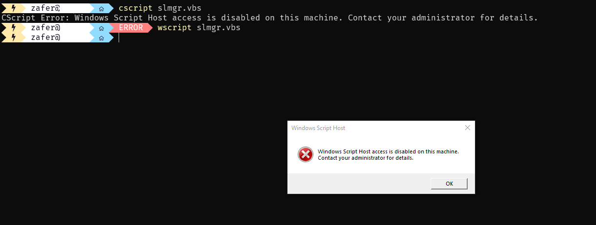
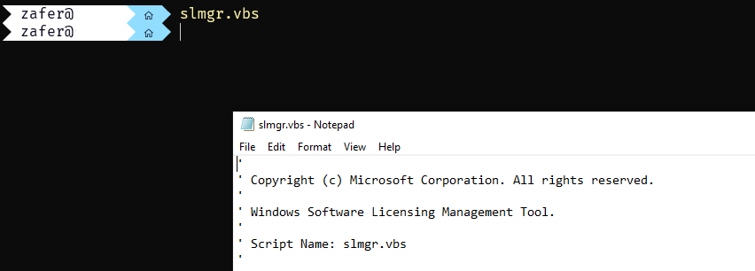

# slmgr-ps

A partial PowerShell alternative for common `slmgr.vbs` workflows.

`slmgr-ps` is not yet a parameter-compatible or feature-complete replacement for `slmgr.vbs`. The current module focuses on common Windows activation operations, especially KMS activation, basic licensing status, offline activation, rearm, product-key removal, product-key registry cleanup, and partial KMS client reset workflows.

## About this module

One of my hardening guidelines is to remove VBScript execution from managed Windows environments where possible.

- I disabled [Windows Script Host](https://blog.f-secure.com/how-to-disable-windows-script-host/), blocking `cscript` and `wscript`.



- I changed the file-type association of `.vbs` so `.vbs` files open in Notepad instead of executing.



That also meant I could no longer use tools such as `slmgr.vbs`, `OSPP.vbs`, and some SCCM/MDT-related scripts in the same way. I started with `slmgr.vbs` because I needed it during a Windows 7 to Windows 10 migration.

The original version was a small PowerShell script based on `slmgr.vbs`. You can still find the old script in [my gist](https://gist.github.com/zbalkan/4ba92656a3a8387e6b220bcf8fcd5fc6).

This repository turns that script into a PowerShell module so it can be installed and used more easily. You can find it in the [PowerShell Gallery](https://www.powershellgallery.com/packages/slmgr-ps).

## Current scope

The module currently exports three public functions:

- `Get-WindowsActivation`
- `Start-WindowsActivation`
- `Reset-WindowsActivation`

The current implementation is intentionally narrower than `slmgr.vbs`. It supports the default Windows licensing product selected by the module. It does not currently support `slmgr.vbs` activation ID targeting, `all` product enumeration, token-based activation, Active Directory-based activation, or KMS host configuration.

## Installation

```powershell
Install-Module slmgr-ps
```

## Basic usage

### Get Windows activation information

```powershell
# Basic license information, similar to slmgr.vbs /dli for the selected Windows product
Get-WindowsActivation

# Extended license information, similar to slmgr.vbs /dlv for the selected Windows product
Get-WindowsActivation -Extended

# Expiration information, similar to slmgr.vbs /xpr for the selected Windows product
Get-WindowsActivation -Expiry

# Offline installation ID, similar to slmgr.vbs /dti for the selected Windows product
Get-WindowsActivation -Offline
```

### Work with remote computers

```powershell
# Basic license information from a remote computer
Get-WindowsActivation -Computer WS01

# Use explicit credentials
Get-WindowsActivation -Computer WS01 -Credentials (Get-Credential)

# Query multiple computers
Get-WindowsActivation -Computer WS01, WS02, WS03
```

Remote operations use PowerShell CIM sessions. Local sessions use DCOM; remote sessions use WinRM. Ensure WinRM is enabled and reachable for remote computers.

### Activate Windows

```powershell
# Activate the selected Windows product using the currently installed key
Start-WindowsActivation -Verbose

# Install the detected KMS client setup key (GVLK), then activate
Start-WindowsActivation -UseKmsClientKey -Verbose

# Activate a remote computer
Start-WindowsActivation -Computer WS01

# Activate a remote computer using explicit credentials
Start-WindowsActivation -Computer WS01 -Credentials (Get-Credential)

# Set a KMS server and port before activation
Start-WindowsActivation -Computer WS01 -KMSServerFQDN kms.example.com -KMSServerPort 1688

# Disable KMS host caching before activation
Start-WindowsActivation -Computer WS01 -CacheDisabled
```

`-UseKmsClientKey` is not a general replacement for `slmgr.vbs /ipk <ProductKey>`. It installs a known KMS client setup key for the detected Windows edition, then attempts activation. This is useful when switching a supported Windows edition to KMS activation, but it does not let you pass an arbitrary product key.

### Offline activation

```powershell
# Get the offline installation ID
Get-WindowsActivation -Offline

# Apply a confirmation ID returned by phone activation
Start-WindowsActivation -Offline -ConfirmationId 123456-123456-123456-123456-123456-123456-123456-123456-123456
```

The confirmation ID may contain dashes or spaces. The module normalizes it before submitting it.

### Rearm

```powershell
Start-WindowsActivation -Rearm
```

Rearm is a material licensing operation. Run it only when you understand the activation state and the effect on the target system.

### Reset activation-related settings

```powershell
# Uninstall the product key from the selected Windows product
Reset-WindowsActivation -UninstallProductKey

# Clear the product key from registry storage
Reset-WindowsActivation -ClearProductKeyFromRegistry

# Clear the configured KMS host name
Reset-WindowsActivation -ClearKMSSettings

# Combine operations
Reset-WindowsActivation -UninstallProductKey -ClearProductKeyFromRegistry -ClearKMSSettings

# Run against a remote computer
Reset-WindowsActivation -Computer WS01 -Credentials (Get-Credential) -UninstallProductKey -ClearProductKeyFromRegistry
```

`-ClearKMSSettings` currently clears the configured KMS host name. It should not be described as full `/ckms` parity until KMS port clearing and activation-ID-specific KMS clearing are implemented and tested.

## Comparison with slmgr.vbs

The following table compares the current `slmgr-ps` implementation with documented `slmgr.vbs` options.

Microsoft documentation: [Slmgr.vbs options for obtaining volume activation information](https://learn.microsoft.com/en-us/windows-server/get-started/activation-slmgr-vbs-options)

### General command shape

```cmd
slmgr.vbs [<ComputerName> [<User> <Password>]] [<Options>]
```

| `slmgr.vbs` capability   | `slmgr-ps` equivalent           |                Status | Notes                                                                             |
| ------------------------ | ------------------------------- | --------------------: | --------------------------------------------------------------------------------- |
| Local execution          | Default `-Computer localhost`   |             Supported | Local CIM sessions use DCOM.                                                      |
| Remote computer          | `-Computer WS01`                |             Supported | Remote CIM sessions use WinRM, not the old `slmgr.vbs` DCOM/WMI command shape.    |
| Remote user and password | `-Credentials (Get-Credential)` | Supported differently | `slmgr-ps` uses `PSCredential` instead of exposing passwords on the command line. |
| Multiple computers       | `-Computer WS01, WS02`          |             Supported | This is a PowerShell-native improvement over the single-target `slmgr.vbs` style. |

### Global options

| `slmgr.vbs` option     | `slmgr-ps` equivalent                      |          Status | Notes                                                                                                   |
| ---------------------- | ------------------------------------------ | --------------: | ------------------------------------------------------------------------------------------------------- |
| `/ipk <ProductKey>`    | `Start-WindowsActivation -UseKmsClientKey` |         Partial | Only detected GVLK installation is supported. Arbitrary product-key input is not currently implemented. |
| `/ato`                 | `Start-WindowsActivation`                  |         Partial | Supports activation of the selected Windows licensing product.                                          |
| `/ato <Activation ID>` | None                                       | Not implemented | Activation-ID targeting is not currently supported.                                                     |
| `/dli`                 | `Get-WindowsActivation`                    |       Supported | Returns basic information for the selected Windows licensing product.                                   |
| `/dli <Activation ID>` | None                                       | Not implemented | Activation-ID targeting is not currently supported.                                                     |
| `/dli all`             | None                                       | Not implemented | All-product enumeration is not currently supported.                                                     |
| `/dlv`                 | `Get-WindowsActivation -Extended`          |       Supported | Returns extended information for the selected Windows licensing product.                                |
| `/dlv <Activation ID>` | None                                       | Not implemented | Activation-ID targeting is not currently supported.                                                     |
| `/dlv all`             | None                                       | Not implemented | All-product enumeration is not currently supported.                                                     |
| `/xpr`                 | `Get-WindowsActivation -Expiry`            |       Supported | Returns expiry status for the selected Windows licensing product.                                       |
| `/xpr <Activation ID>` | None                                       | Not implemented | Activation-ID targeting is not currently supported.                                                     |

### Advanced options

| `slmgr.vbs` option                       | `slmgr-ps` equivalent                                                |          Status | Notes                                                                                 |
| ---------------------------------------- | -------------------------------------------------------------------- | --------------: | ------------------------------------------------------------------------------------- |
| `/cpky`                                  | `Reset-WindowsActivation -ClearProductKeyFromRegistry`               |         Partial | Exposed by the module. Should be tested carefully against supported Windows versions. |
| `/ilc <license_file>`                    | None                                                                 | Not implemented | License-file installation is not currently supported.                                 |
| `/rilc`                                  | None                                                                 | Not implemented | License reinstallation from system token folders is not currently supported.          |
| `/rearm`                                 | `Start-WindowsActivation -Rearm`                                     |       Supported | Resets activation state where supported by Windows.                                   |
| `/rearm-app <Application ID>`            | None                                                                 | Not implemented | Application-level rearm is not currently supported.                                   |
| `/rearm-sku <Activation ID>`             | None                                                                 | Not implemented | SKU-level rearm is not currently supported.                                           |
| `/upk`                                   | `Reset-WindowsActivation -UninstallProductKey`                       |       Supported | Uninstalls the product key from the selected Windows licensing product.               |
| `/upk <Activation ID>`                   | None                                                                 | Not implemented | Activation-ID targeting is not currently supported.                                   |
| `/dti`                                   | `Get-WindowsActivation -Offline`                                     |       Supported | Returns the offline installation ID for the selected Windows licensing product.       |
| `/dti <Activation ID>`                   | None                                                                 | Not implemented | Activation-ID targeting is not currently supported.                                   |
| `/atp <Confirmation ID>`                 | `Start-WindowsActivation -Offline -ConfirmationId <Confirmation ID>` |       Supported | Applies a confirmation ID to the selected Windows licensing product.                  |
| `/atp <Confirmation ID> <Activation ID>` | None                                                                 | Not implemented | Activation-ID targeting is not currently supported.                                   |

### KMS client options

| `slmgr.vbs` option                    | `slmgr-ps` equivalent                                                 |          Status | Notes                                                                                                                     |
| ------------------------------------- | --------------------------------------------------------------------- | --------------: | ------------------------------------------------------------------------------------------------------------------------- |
| `/skms <Name[:Port]>`                 | `Start-WindowsActivation -KMSServerFQDN <FQDN> -KMSServerPort <Port>` |         Partial | FQDN and port are supported. `:port`-only input, raw IPv6 forms, and activation-ID targeting are not currently supported. |
| `/skms <Name[:Port]> <Activation ID>` | None                                                                  | Not implemented | Product-specific KMS settings are not currently supported.                                                                |
| `/skms-domain <FQDN>`                 | None                                                                  | Not implemented | KMS lookup-domain configuration is not currently supported.                                                               |
| `/skms-domain <FQDN> <Activation ID>` | None                                                                  | Not implemented | Product-specific KMS lookup-domain configuration is not currently supported.                                              |
| `/ckms`                               | `Reset-WindowsActivation -ClearKMSSettings`                           |         Partial | Currently clears the configured KMS host name. Full `/ckms` parity should also clear the configured KMS port.             |
| `/ckms <Activation ID>`               | None                                                                  | Not implemented | Product-specific KMS clearing is not currently supported.                                                                 |
| `/skhc`                               | None                                                                  | Not implemented | KMS host caching is enabled by default in Windows. Explicit enable support is not currently exposed.                      |
| `/ckhc`                               | `Start-WindowsActivation -CacheDisabled`                              |         Partial | Disables KMS host caching as part of the activation workflow. Standalone cache-control is not currently exposed.          |

### KMS host configuration options

| `slmgr.vbs` option                       | `slmgr-ps` equivalent |          Status | Notes                                                                             |
| ---------------------------------------- | --------------------- | --------------: | --------------------------------------------------------------------------------- |
| `/sai <Interval>`                        | None                  | Not implemented | KMS host activation interval configuration is not currently supported.            |
| `/sri <Interval>`                        | None                  | Not implemented | KMS host renewal interval configuration is not currently supported.               |
| `/sprt <Port>`                           | None                  | Not implemented | KMS host listening-port configuration is not currently supported.                 |
| `/sdns`                                  | None                  | Not implemented | KMS host DNS publishing enable is not currently supported.                        |
| `/cdns`                                  | None                  | Not implemented | KMS host DNS publishing disable is not currently supported.                       |
| `/spri`                                  | None                  | Not implemented | KMS host normal-priority configuration is not currently supported.                |
| `/cpri`                                  | None                  | Not implemented | KMS host low-priority configuration is not currently supported.                   |
| `/act-type`                              | None                  | Not implemented | Volume activation type clearing is not currently supported.                       |
| `/act-type <0\|1\|2\|3>`                 | None                  | Not implemented | Global volume activation type configuration is not currently supported.           |
| `/act-type <0\|1\|2\|3> <Activation ID>` | None                  | Not implemented | Product-specific volume activation type configuration is not currently supported. |

### Token-based activation options

| `slmgr.vbs` option                    | `slmgr-ps` equivalent |          Status | Notes                                                            |
| ------------------------------------- | --------------------- | --------------: | ---------------------------------------------------------------- |
| `/lil`                                | None                  | Not implemented | Issuance-license listing is not currently supported.             |
| `/ril <ILID> <ILvID>`                 | None                  | Not implemented | Issuance-license removal is not currently supported.             |
| `/ltc`                                | None                  | Not implemented | Token activation certificate listing is not currently supported. |
| `/fta <Certificate Thumbprint>`       | None                  | Not implemented | Token activation is not currently supported.                     |
| `/fta <Certificate Thumbprint> <PIN>` | None                  | Not implemented | Token activation with PIN is not currently supported.            |
| `/stao`                               | None                  | Not implemented | Deprecated in modern Windows; use `/act-type` in `slmgr.vbs`.    |
| `/ctao`                               | None                  | Not implemented | Deprecated in modern Windows; use `/act-type` in `slmgr.vbs`.    |

### Active Directory-based activation options

| `slmgr.vbs` option                                                                  | `slmgr-ps` equivalent |          Status | Notes                                                                |
| ----------------------------------------------------------------------------------- | --------------------- | --------------: | -------------------------------------------------------------------- |
| `/ad-activation-online <Product Key>`                                               | None                  | Not implemented | AD-based activation is not currently supported.                      |
| `/ad-activation-online <Product Key> <Activation Object name>`                      | None                  | Not implemented | AD activation object naming is not currently supported.              |
| `/ad-activation-get-iid <Product Key>`                                              | None                  | Not implemented | AD phone activation IID generation is not currently supported.       |
| `/ad-activation-apply-cid <Product Key> <Confirmation ID>`                          | None                  | Not implemented | AD offline activation confirmation is not currently supported.       |
| `/ad-activation-apply-cid <Product Key> <Confirmation ID> <Activation Object name>` | None                  | Not implemented | AD offline activation with object naming is not currently supported. |
| `/ao-list`                                                                          | None                  | Not implemented | AD activation-object listing is not currently supported.             |
| `/del-ao <AO_DN>` or `/del-ao <AO_RDN>`                                             | None                  | Not implemented | AD activation-object deletion is not currently supported.            |

## Design differences from slmgr.vbs

`slmgr-ps` is not a direct port of the command-line interface. It uses PowerShell conventions instead.

- It accepts arrays of computer names.
- It uses `PSCredential` rather than command-line password arguments.
- It uses CIM sessions.
- Remote execution uses WinRM.
- It returns PowerShell objects for reporting commands.
- It supports PowerShell pipeline-friendly usage.
- It includes KMS client setup keys for supported Windows editions.
- It works without Windows Script Host, so environments that block `cscript.exe` and `wscript.exe` can still perform supported activation workflows.

## Current limitations

The following areas are intentionally not presented as supported yet:

- Arbitrary `/ipk <ProductKey>` input.
- Activation-ID targeting.
- `all` product enumeration.
- Product-specific KMS settings.
- KMS lookup-domain configuration.
- Full KMS settings reset including port clearing.
- KMS host configuration.
- License-file installation and license repair.
- Token-based activation.
- Active Directory-based activation.
- `slmgr.vbs` command-line syntax compatibility.

## Security notes

Avoid passing secrets directly on the command line. `slmgr.vbs` supports a command shape that includes username and password as arguments. `slmgr-ps` uses `PSCredential` instead, which is more appropriate for PowerShell usage and avoids exposing passwords in command-line history or process listings.

For remote execution, prefer properly configured WinRM. Where appropriate, use HTTPS for WinRM. See Microsoft documentation on [WinRM security](https://learn.microsoft.com/en-us/powershell/scripting/security/remoting/winrm-security).

## Troubleshooting

Use `-Verbose` for operational detail:

```powershell
Get-WindowsActivation -Verbose
Start-WindowsActivation -Verbose
Reset-WindowsActivation -Verbose -ClearKMSSettings
```

Use `-Debug` when investigating lower-level behavior:

```powershell
Start-WindowsActivation -Debug
```

Mutating operations should be run from an elevated PowerShell session. Read-only commands are intended to work without elevation, but module import behavior should be tested in your target PowerShell and Windows versions.

## Contributing

The long-term goal is to cover more of the practical `slmgr.vbs` workflow surface while keeping the PowerShell interface safer and more maintainable than the original VBScript command style.

Useful contribution areas include:

- Adding arbitrary product-key installation with safe handling.
- Adding activation-ID selectors.
- Adding `all` product enumeration.
- Completing KMS settings reset.
- Adding KMS lookup-domain support.
- Adding standalone KMS cache enable/disable commands.
- Adding KMS host configuration workflows.
- Adding license installation and repair workflows.
- Adding tests for WMI/CIM method compatibility across supported Windows versions.
- Improving documentation and examples.

Please refer to [CONTRIBUTING.md](CONTRIBUTING.md) for pull request guidance.
