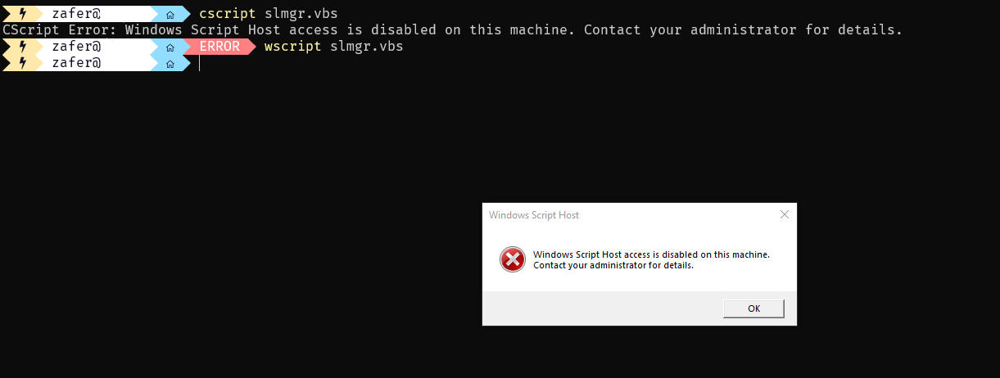
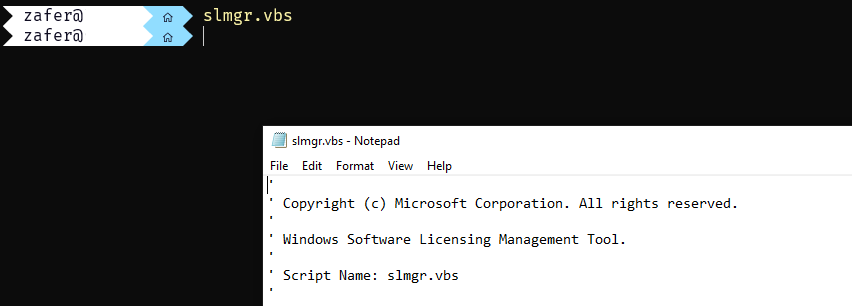

# slmgr-ps

A partial PowerShell alternative for common `slmgr.vbs` workflows.

`slmgr-ps` is not yet a parameter-compatible or feature-complete replacement for `slmgr.vbs`. The current module focuses on common Windows licensing and activation operations, including licensing status, online and offline activation, license installation and repair, rearm, product-key removal, KMS client configuration, activation-type policy, token issuance-license management, and documented Active Directory-based activation workflows.

## About this module

One of my hardening guidelines is to remove VBScript execution from managed Windows environments where possible.

- I disabled [Windows Script Host](https://www.f-secure.com/en/articles/how-to-disable-windows-script-host), blocking `cscript` and `wscript`.



- I changed the file-type association of `.vbs` so `.vbs` files open in Notepad instead of executing.



That also meant I could no longer use tools such as `slmgr.vbs`, `OSPP.vbs`, and some SCCM/MDT-related scripts in the same way. I started with `slmgr.vbs` because I needed it during a Windows 7 to Windows 10 migration.

The original version was a small PowerShell script based on `slmgr.vbs`. You can still find the old script in [my gist](https://gist.github.com/zbalkan/4ba92656a3a8387e6b220bcf8fcd5fc6).

This repository turns that script into a PowerShell module so it can be installed and used more easily. You can find it in the [PowerShell Gallery](https://www.powershellgallery.com/packages/slmgr-ps).

Microsoft now provides the official [OSLicense PowerShell module](https://learn.microsoft.com/en-gb/powershell/module/oslicense/?view=windowsserver2025-ps). `slmgr-ps` remains an independent community alternative: it uses documented Windows Software Protection Platform CIM interfaces and public Windows interfaces directly and does not import, call, wrap, or depend on OSLicense components.

## Current scope

The module currently exports thirteen public functions:

- `Get-WindowsActivation`
- `Get-WindowsADActivationInstallationId`
- `Get-WindowsADActivationObject`
- `Get-WindowsTokenActivationLicense`
- `Install-WindowsLicense`
- `New-WindowsADActivationObject`
- `Remove-WindowsADActivationObject`
- `Remove-WindowsTokenActivationLicense`
- `Repair-WindowsLicense`
- `Reset-WindowsActivation`
- `Set-WindowsActivationType`
- `Set-WindowsKmsClient`
- `Start-WindowsActivation`

The implementation supports default, activation-ID, and all-product client queries; targeted client activation and reset operations; KMS client configuration; activation-type policy; license installation; local system-license repair; targeted rearm; token issuance-license listing and removal; and documented Active Directory activation-object workflows. KMS host configuration and token certificate/PIN activation remain outside the supported surface.

## Installation

```powershell
Install-Module slmgr-ps
```

## Basic usage

### Get Windows activation information

```powershell
# Basic license information, similar to slmgr.vbs /dli for the selected Windows product
Get-WindowsActivation

# Extended license information, similar to slmgr.vbs /dlv for the selected Windows product
Get-WindowsActivation -Extended

# Expiration information, similar to slmgr.vbs /xpr for the selected Windows product
Get-WindowsActivation -Expiry

# Offline installation ID, similar to slmgr.vbs /dti for offline -aka phone- activation
Get-WindowsActivation -Offline

# Query one product by activation ID
Get-WindowsActivation -ActivationId aaaaaaaa-bbbb-cccc-dddd-eeeeeeeeeeee

# Enumerate all SPP products in the basic or extended view
Get-WindowsActivation -All
Get-WindowsActivation -Extended -All
```

Extended output includes the raw numeric and readable license status, status reason, grace period, evaluation end date, Windows/application/SKU rearm counts, trusted time, SPP service version, client-machine ID, KMS-host status, volume activation and renewal intervals, configured activation-type policy, last volume activation type, token activation state, Active Directory activation-object metadata, configured and discovered KMS host and port values, the KMS lookup domain, and service-wide host-caching state when the provider exposes them. Unset provider dates are returned as `$null`.

### Work with remote computers

```powershell
# Basic license information from a remote computer
Get-WindowsActivation -Computer WS01

# Use explicit credentials
Get-WindowsActivation -Computer WS01 -Credentials (Get-Credential)

# Query multiple computers
Get-WindowsActivation -Computer WS01, WS02, WS03
```

Remote CIM operations use PowerShell CIM sessions. Local sessions use DCOM; remote sessions use WinRM. Ensure WinRM is enabled and reachable for remote computers. Active Directory activation-object commands use the ActiveDirectory PowerShell module and directory connectivity instead of the CIM remote-execution path.

### Activate Windows

```powershell
# Activate the selected Windows product using the currently installed key
Start-WindowsActivation -Verbose

# Install the detected KMS client setup key (GVLK), then activate
Start-WindowsActivation -UseKmsClientKey -Verbose

# Install an explicit product key, then activate in the same operation
Start-WindowsActivation -ProductKey XXXXX-XXXXX-XXXXX-XXXXX-XXXXX

# Activate one product by activation ID
Start-WindowsActivation -ActivationId aaaaaaaa-bbbb-cccc-dddd-eeeeeeeeeeee

# Activate a remote computer
Start-WindowsActivation -Computer WS01

# Activate a remote computer using explicit credentials
Start-WindowsActivation -Computer WS01 -Credentials (Get-Credential)

# Set a KMS server and port before activation
Start-WindowsActivation -Computer WS01 -KmsServer kms.example.com -KMSServerPort 1688

# Bracket IPv6 when including it with a port
Start-WindowsActivation -KmsServer '[2001:db8::10]:1688'

# Disable KMS host caching before activation
Start-WindowsActivation -Computer WS01 -CacheDisabled
```

`-UseKmsClientKey` installs a known KMS client setup key for the detected Windows edition. `-ProductKey` accepts an explicit key. Both forms then resolve the product registration matching the installed key and attempt activation because this module deliberately combines key installation and activation into one operation.

Do not combine `-ActivationId` with `-ProductKey` or `-UseKmsClientKey`. Windows exposes key installation on `SoftwareLicensingService`, not on an individual licensing product, so that combination cannot safely guarantee that the requested activation ID receives the key. To target an activation ID, install no key in that invocation and use `-ActivationId` by itself.

### Configure the KMS client

```powershell
# Configure a server and the default KMS port without activating
Set-WindowsKmsClient -KmsServer kms01.example.test

# Configure a server with an embedded port
Set-WindowsKmsClient -KmsServer '192.0.2.10:2500'

# Change only the configured port
Set-WindowsKmsClient -Port 2500

# Configure the DNS lookup domain
Set-WindowsKmsClient -LookupDomain activation.example.test

# Disable or enable service-wide KMS host caching
Set-WindowsKmsClient -HostCaching Disabled
Set-WindowsKmsClient -HostCaching Enabled

# Configure an exact licensing product where the provider supports product scope
Set-WindowsKmsClient -KmsServer kms01 -Port 2500 `
    -ActivationId aaaaaaaa-bbbb-cccc-dddd-eeeeeeeeeeee
```

`-KmsServer` accepts a single-label hostname, FQDN, IPv4 address, or bracketed IPv6 address. A port can be embedded in the endpoint or supplied with `-Port`, but not both. Changing a server without specifying a port sets port 1688 so a stale custom port is not retained. `-HostCaching` is service-wide and therefore cannot be combined with `-ActivationId`.

`Start-WindowsActivation -KmsServer ...` preserves the combined configuration-and-activation workflow. `-KMSServerFQDN` remains an accepted parameter name for compatibility.

### Configure volume activation policy

```powershell
# Allow any supported volume activation mechanism
Set-WindowsActivationType -ActivationType Any

# Restrict activation to Active Directory, KMS, or token activation
Set-WindowsActivationType -ActivationType ActiveDirectory
Set-WindowsActivationType -ActivationType Kms
Set-WindowsActivationType -ActivationType Token

# Apply the policy to an exact licensing product
Set-WindowsActivationType -ActivationType Kms `
    -ActivationId aaaaaaaa-bbbb-cccc-dddd-eeeeeeeeeeee
```

`Any` clears the configured activation-type restriction. The restricted values map to the documented Software Protection Platform activation-type values. Policy changes return the common structured mutation result and report `ProviderAccepted` because the provider call does not itself return an authoritative post-state object.

### Offline activation

```powershell
# Get the offline installation ID
Get-WindowsActivation -Offline

# Apply a confirmation ID returned by phone activation
Start-WindowsActivation -Offline -ConfirmationId 123456-123456-123456-123456-123456-123456-123456-123456-123456

# Apply a confirmation ID to one product
Start-WindowsActivation -Offline -ConfirmationId 123456-123456-123456-123456-123456-123456-123456-123456-123456 -ActivationId aaaaaaaa-bbbb-cccc-dddd-eeeeeeeeeeee
```

The confirmation ID may contain dashes or spaces. The module normalizes it before submitting it.

### Token activation issuance licenses

```powershell
# List installed token activation issuance licenses
Get-WindowsTokenActivationLicense

# Query a remote computer
Get-WindowsTokenActivationLicense -Computer WS01 -Credentials (Get-Credential)

# Remove one exact issuance license
Remove-WindowsTokenActivationLicense `
    -ILID 11111111-2222-3333-4444-555555555555 `
    -ILVID 7
```

Issuance-license removal requires the exact ILID and ILVID pair. The module calls the documented `SoftwareLicensingTokenActivationLicense.Uninstall()` method and verifies that the exact license is no longer returned by the provider. Token certificate enumeration and certificate/PIN-driven activation are not implemented because the required end-to-end workflow is not sufficiently documented through public interfaces.

### Active Directory-based activation

Active Directory activation-object workflows require the ActiveDirectory PowerShell module and access to the target forest. Product keys and confirmation IDs are sensitive input and are not included in normal result objects.

```powershell
# Generate the installation ID for an offline AD activation workflow
Get-WindowsADActivationInstallationId -ProductKey XXXXX-XXXXX-XXXXX-XXXXX-XXXXX

# Create and publish an activation object online
New-WindowsADActivationObject `
    -ProductKey XXXXX-XXXXX-XXXXX-XXXXX-XXXXX `
    -ActivationObjectName 'Windows Activation'

# Complete the offline workflow after receiving a confirmation ID
New-WindowsADActivationObject `
    -ProductKey XXXXX-XXXXX-XXXXX-XXXXX-XXXXX `
    -ConfirmationId 123456-123456-123456-123456-123456-123456-123456-123456-123456 `
    -ActivationObjectName 'Windows Activation'

# List activation objects or resolve one object
Get-WindowsADActivationObject
Get-WindowsADActivationObject -Name 'Windows Activation'
Get-WindowsADActivationObject -DistinguishedName 'CN=example,CN=Activation Objects,CN=Microsoft SPP,CN=Services,CN=Configuration,DC=example,DC=test'

# Remove an exact activation object
Remove-WindowsADActivationObject `
    -DistinguishedName 'CN=example,CN=Activation Objects,CN=Microsoft SPP,CN=Services,CN=Configuration,DC=example,DC=test'
```

`New-WindowsADActivationObject` requires an explicit activation-object name so the module can reject duplicates before mutation and verify the exact object afterward. Directory context is resolved through the ActiveDirectory module; the activation-object container is queried from the directory instead of constructing an LDAP distinguished name by concatenation. Deletion accepts only an exact distinguished name, uses high-impact confirmation, and verifies that the object disappeared.

Use `-DirectoryServer` and `-DirectoryCredential` when explicit directory targeting is required.

### Rearm

```powershell
# Rearm Windows when the current state is eligible
Start-WindowsActivation -Rearm

# Rearm one application by application ID
Start-WindowsActivation -Rearm -ApplicationId 11111111-2222-3333-4444-555555555555

# Rearm one licensing product by activation ID
Start-WindowsActivation -Rearm -ActivationId aaaaaaaa-bbbb-cccc-dddd-eeeeeeeeeeee
```

`-ApplicationId` and `-ActivationId` are mutually exclusive and require `-Rearm`. Rearm is a material licensing operation and normally requires a restart before the change takes effect. Run it only when you understand the activation state and the effect on the target system.

### Install and repair licenses

```powershell
# Install one license file on the local computer
Install-WindowsLicense -Path C:\Licenses\example.xrm-ms

# Install multiple license files on multiple computers
Install-WindowsLicense -Computer WS01, WS02 -Credentials (Get-Credential) `
    -Path C:\Licenses\base.xrm-ms, C:\Licenses\edition.xrm-ms

# Reinstall licenses from this computer's Windows OEM and SPP token directories
Repair-WindowsLicense
```

`Install-WindowsLicense` resolves and reads the supplied files on the computer running PowerShell, then sends their contents through CIM to each target. It accepts `.xrm-ms` files only, rejects empty and duplicate paths, attempts every validated file and computer, refreshes licensing after successful installations, and terminates with an aggregate error if any target operation failed.

`Repair-WindowsLicense` is intentionally local-only. It reads the license files from the current Windows installation so licenses from the management computer cannot accidentally be applied to a remote target. It skips filesystem reparse points, processes files in deterministic order, continues past individual failures, and refreshes licensing when at least one file was reinstalled.

### Reset activation-related settings

```powershell
# Uninstall the product key from the selected Windows product
Reset-WindowsActivation -UninstallProductKey

# Uninstall the key from one product
Reset-WindowsActivation -UninstallProductKey -ActivationId aaaaaaaa-bbbb-cccc-dddd-eeeeeeeeeeee

# Clear the product key from registry storage
Reset-WindowsActivation -ClearProductKeyFromRegistry

# Clear the configured KMS host name and port
Reset-WindowsActivation -ClearKMSSettings

# Clear product-specific KMS client settings
Reset-WindowsActivation -ClearKMSSettings -ActivationId aaaaaaaa-bbbb-cccc-dddd-eeeeeeeeeeee

# Clear the KMS lookup domain without clearing the configured host and port
Reset-WindowsActivation -ClearKMSLookupDomain

# Clear a product-specific KMS lookup domain
Reset-WindowsActivation -ClearKMSLookupDomain -ActivationId aaaaaaaa-bbbb-cccc-dddd-eeeeeeeeeeee

# Combine operations
Reset-WindowsActivation -UninstallProductKey -ClearProductKeyFromRegistry -ClearKMSSettings

# Run against a remote computer
Reset-WindowsActivation -Computer WS01 -Credentials (Get-Credential) -UninstallProductKey -ClearProductKeyFromRegistry
```

`-ClearKMSSettings` clears the configured KMS host name and port. It preserves a configured KMS lookup domain, matching `/ckms` behavior. Use `-ClearKMSLookupDomain` to clear the domain independently. With `-ActivationId`, either switch invokes the product-scoped KMS client methods.

### Operation results and errors

Mutating commands emit a `slmgr-ps.LicensingOperationResult` when they use the common licensing mutation contract. The contract is used across activation, rearm, KMS client configuration, activation-type policy, reset, license installation, system-license repair, token issuance-license removal, and Active Directory activation-object mutation.

| Field | Meaning |
| --- | --- |
| `ComputerName` | Target computer associated with the operation. |
| `Success` | Whether the requested operation completed according to its verification contract. |
| `Operation` | Stable operation identifier suitable for automation. |
| `ActivationId` | Exact affected licensing product identifier when applicable. |
| `ProductName` | Resolved product name when applicable and available. |
| `RestartRequired` | Whether a restart is required before the change is fully effective. |
| `ErrorCode` | SPP or CIM error code formatted as `0xXXXXXXXX` when one is available. Generic PowerShell or .NET errors do not invent a licensing error code. |
| `ErrorMessage` | Provider or exception message without intentionally echoing sensitive command input. |
| `VerificationState` | `Verified`, `ProviderAccepted`, `NotVerifiable`, or `Failed`. |

`Verified` means the module queried a reliable final state and confirmed the intended outcome. `ProviderAccepted` means the documented provider call succeeded but the final state cannot yet be established reliably, such as a rearm operation that requires restart. `NotVerifiable` is reserved for successful operations for which the provider exposes no reliable read-back path. `Failed` identifies a failed target.

For multi-computer operations, the module continues with later targets when it is safe to do so. If any target fails, the command terminates after the batch with a `LicensingBatchFailed` error. Its `TargetObject` contains the failed `LicensingOperationResult` objects, and detailed per-target errors are retained in the exception data. The module does not write the same collected failure repeatedly before throwing the aggregate error.

## Comparison with slmgr.vbs

The following table compares the current `slmgr-ps` implementation with documented `slmgr.vbs` options.

Microsoft documentation: [Slmgr.vbs options for obtaining volume activation information](https://learn.microsoft.com/en-us/windows-server/get-started/activation-slmgr-vbs-options)

### General command shape

```cmd
slmgr.vbs [<ComputerName> [<User> <Password>]] [<Options>]
```

| `slmgr.vbs` capability   | `slmgr-ps` equivalent           |                Status | Notes                                                                             |
| ------------------------ | ------------------------------- | --------------------: | --------------------------------------------------------------------------------- |
| Local execution          | Default `-Computer localhost`   |             Supported | Local CIM sessions use DCOM.                                                      |
| Remote computer          | `-Computer WS01`                |             Supported | Remote CIM sessions use WinRM, not the old `slmgr.vbs` DCOM/WMI command shape.    |
| Remote user and password | `-Credentials (Get-Credential)` | Supported differently | `slmgr-ps` uses `PSCredential` instead of exposing passwords on the command line. |
| Multiple computers       | `-Computer WS01, WS02`          |             Supported | This is a PowerShell-native improvement over the single-target `slmgr.vbs` style. |

### Global options

| `slmgr.vbs` option     | `slmgr-ps` equivalent                                          |                Status | Notes                                                                                                   |
| ---------------------- | -------------------------------------------------------------- | --------------------: | ------------------------------------------------------------------------------------------------------- |
| `/ipk <ProductKey>`    | `Start-WindowsActivation -ProductKey <ProductKey>`             | Supported differently | Installs the supplied key and immediately attempts activation in the same operation.                    |
| `/ato`                 | `Start-WindowsActivation`                                      |             Supported | Activates the selected Windows licensing product.                                                       |
| `/ato <Activation ID>` | `Start-WindowsActivation -ActivationId <ActivationId>`         |             Supported | Resolves and activates the exact SPP product.                                                           |
| `/dli`                 | `Get-WindowsActivation`                                        |             Supported | Returns basic information for the selected Windows licensing product.                                   |
| `/dli <Activation ID>` | `Get-WindowsActivation -ActivationId <ActivationId>`           |             Supported | Returns basic information for the exact SPP product.                                                    |
| `/dli all`             | `Get-WindowsActivation -All`                                   |             Supported | Returns basic information for every SPP product.                                                        |
| `/dlv`                 | `Get-WindowsActivation -Extended`                              |             Supported | Returns extended information for the selected Windows licensing product.                                |
| `/dlv <Activation ID>` | `Get-WindowsActivation -Extended -ActivationId <ActivationId>` |             Supported | Returns extended information for the exact SPP product.                                                 |
| `/dlv all`             | `Get-WindowsActivation -Extended -All`                         |             Supported | Returns extended information for every SPP product.                                                     |
| `/xpr`                 | `Get-WindowsActivation -Expiry`                                |             Supported | Returns expiry status for the selected Windows licensing product.                                       |
| `/xpr <Activation ID>` | `Get-WindowsActivation -Expiry -ActivationId <ActivationId>`   |             Supported | Returns expiry information for the exact SPP product.                                                   |

### Advanced options

| `slmgr.vbs` option                       | `slmgr-ps` equivalent                                                                            |                Status | Notes                                                                                 |
| ---------------------------------------- | ------------------------------------------------------------------------------------------------ | --------------------: | ------------------------------------------------------------------------------------- |
| `/cpky`                                  | `Reset-WindowsActivation -ClearProductKeyFromRegistry`                                           |             Supported | Clears the product key from registry storage through `SoftwareLicensingService`.      |
| `/ilc <license_file>`                    | `Install-WindowsLicense -Path <license_file>`                                                    | Supported differently | Reads the controller-side `.xrm-ms` file and installs its content through CIM.        |
| `/rilc`                                  | `Repair-WindowsLicense`                                                                          |     Supported locally | Reinstalls `.xrm-ms` files from the local Windows OEM and SPP token directories.      |
| `/rearm`                                 | `Start-WindowsActivation -Rearm`                                                                 |             Supported | Resets activation state where supported by Windows.                                   |
| `/rearm-app <Application ID>`            | `Start-WindowsActivation -Rearm -ApplicationId <ApplicationId>`                                  |             Supported | Rearms the exact application through `SoftwareLicensingService`.                      |
| `/rearm-sku <Activation ID>`             | `Start-WindowsActivation -Rearm -ActivationId <ActivationId>`                                    |             Supported | Resolves and rearms the exact licensing product.                                      |
| `/upk`                                   | `Reset-WindowsActivation -UninstallProductKey`                                                   |             Supported | Uninstalls the product key from the selected Windows licensing product.               |
| `/upk <Activation ID>`                   | `Reset-WindowsActivation -UninstallProductKey -ActivationId <ActivationId>`                      |             Supported | Uninstalls the key from the exact SPP product.                                        |
| `/dti`                                   | `Get-WindowsActivation -Offline`                                                                 |             Supported | Returns the offline installation ID for the selected Windows licensing product.       |
| `/dti <Activation ID>`                   | `Get-WindowsActivation -Offline -ActivationId <ActivationId>`                                    |             Supported | Returns the offline installation ID for the exact SPP product.                        |
| `/atp <Confirmation ID>`                 | `Start-WindowsActivation -Offline -ConfirmationId <Confirmation ID>`                             |             Supported | Applies a confirmation ID to the selected Windows licensing product.                  |
| `/atp <Confirmation ID> <Activation ID>` | `Start-WindowsActivation -Offline -ConfirmationId <ConfirmationId> -ActivationId <ActivationId>` |             Supported | Applies the confirmation ID to the exact SPP product.                                 |

### KMS client options

| `slmgr.vbs` option                    | `slmgr-ps` equivalent                                                    |          Status | Notes                                                                                                                     |
| ------------------------------------- | ------------------------------------------------------------------------ | --------------: | ------------------------------------------------------------------------------------------------------------------------- |
| `/skms <Name[:Port]>`                 | `Set-WindowsKmsClient -KmsServer <Name[:Port]>`                          |       Supported | Accepts hostnames, FQDNs, IPv4, and bracketed IPv6. Use `-Port` alone for the `:Port` form.                               |
| `/skms <Name[:Port]> <Activation ID>` | Add `-ActivationId <ActivationId>` to the command above                  |       Supported | Applies the endpoint to the exact licensing product. `Start-WindowsActivation` can configure and activate in one call.    |
| `/skms-domain <FQDN>`                 | `Set-WindowsKmsClient -LookupDomain <FQDN>`                              |       Supported | Configures the service-wide KMS DNS lookup domain.                                                                        |
| `/skms-domain <FQDN> <Activation ID>` | Add `-ActivationId <ActivationId>` to the command above                  |       Supported | Configures the lookup domain on the exact licensing product.                                                              |
| `/ckms`                               | `Reset-WindowsActivation -ClearKMSSettings`                              |       Supported | Clears the configured KMS host name and port while preserving the KMS lookup domain.                                      |
| `/ckms <Activation ID>`               | `Reset-WindowsActivation -ClearKMSSettings -ActivationId <ActivationId>` |       Supported | Clears product-specific KMS client host and port settings.                                                                |
| `/ckms-domain`                        | `Reset-WindowsActivation -ClearKMSLookupDomain`                          |       Supported | Clears the lookup domain without clearing the configured host and port.                                                   |
| `/skhc`                               | `Set-WindowsKmsClient -HostCaching Enabled`                              |       Supported | Enables service-wide KMS host caching.                                                                                    |
| `/ckhc`                               | `Set-WindowsKmsClient -HostCaching Disabled`                             |       Supported | Disables service-wide KMS host caching. `Start-WindowsActivation -CacheDisabled` remains available for combined use.      |

### Volume activation policy

| `slmgr.vbs` option                       | `slmgr-ps` equivalent                                                       |                Status | Notes                                                                 |
| ---------------------------------------- | --------------------------------------------------------------------------- | --------------------: | --------------------------------------------------------------------- |
| `/act-type`                              | `Set-WindowsActivationType -ActivationType Any`                             | Supported differently | Clears the activation-type restriction.                               |
| `/act-type <0\|1\|2\|3>`                 | `Set-WindowsActivationType -ActivationType <Any\|ActiveDirectory\|Kms\|Token>` | Supported differently | Uses readable PowerShell values instead of numeric policy values.     |
| `/act-type <0\|1\|2\|3> <Activation ID>` | Add `-ActivationId <ActivationId>`                                          | Supported differently | Applies the policy to the exact licensing product.                    |

### KMS server configuration options

| `slmgr.vbs` option | `slmgr-ps` equivalent |          Status | Notes                                                                  |
| ------------------ | --------------------- | --------------: | ---------------------------------------------------------------------- |
| `/sai <Interval>`  | None                  | Not implemented | KMS host activation interval configuration is not currently supported. |
| `/sri <Interval>`  | None                  | Not implemented | KMS host renewal interval configuration is not currently supported.    |
| `/sprt <Port>`     | None                  | Not implemented | KMS host listening-port configuration is not currently supported.      |
| `/sdns`            | None                  | Not implemented | KMS host DNS publishing enable is not currently supported.             |
| `/cdns`            | None                  | Not implemented | KMS host DNS publishing disable is not currently supported.            |
| `/spri`            | None                  | Not implemented | KMS host normal-priority configuration is not currently supported.     |
| `/cpri`            | None                  | Not implemented | KMS host low-priority configuration is not currently supported.        |

### Token-based activation options

| `slmgr.vbs` option                    | `slmgr-ps` equivalent                                                     |                Status | Notes                                                                        |
| ------------------------------------- | ------------------------------------------------------------------------- | --------------------: | ---------------------------------------------------------------------------- |
| `/lil`                                | `Get-WindowsTokenActivationLicense`                                       |             Supported | Returns installed token activation issuance licenses as structured objects.  |
| `/ril <ILID> <ILvID>`                 | `Remove-WindowsTokenActivationLicense -ILID <ILID> -ILVID <ILVID>`        |             Supported | Requires the exact issuance-license identity and verifies removal.            |
| `/ltc`                                | None                                                                      | Not implemented       | Token activation certificate listing is not currently supported.             |
| `/fta <Certificate Thumbprint>`       | None                                                                      | Not implemented       | Certificate-driven token activation is not currently supported.               |
| `/fta <Certificate Thumbprint> <PIN>` | None                                                                      | Not implemented       | PIN-assisted token activation is not implemented through undocumented paths. |
| `/stao`                               | `Set-WindowsActivationType -ActivationType Token`                         | Supported differently | Uses the modern activation-type policy interface.                             |
| `/ctao`                               | `Set-WindowsActivationType -ActivationType Any`                           | Supported differently | Clears the activation-type restriction.                                       |

### Active Directory-based activation options

| `slmgr.vbs` option                                                                  | `slmgr-ps` equivalent                                                                                               |                Status | Notes                                                                                                     |
| ----------------------------------------------------------------------------------- | ------------------------------------------------------------------------------------------------------------------- | --------------------: | --------------------------------------------------------------------------------------------------------- |
| `/ad-activation-online <Product Key>`                                               | `New-WindowsADActivationObject -ProductKey <ProductKey> -ActivationObjectName <Name>`                               | Supported differently | `slmgr-ps` requires an explicit object name so duplicate detection and post-create verification are exact. |
| `/ad-activation-online <Product Key> <Activation Object name>`                      | `New-WindowsADActivationObject -ProductKey <ProductKey> -ActivationObjectName <Name>`                               |             Supported | Creates and verifies the named activation object.                                                          |
| `/ad-activation-get-iid <Product Key>`                                              | `Get-WindowsADActivationInstallationId -ProductKey <ProductKey>`                                                     |             Supported | Returns structured installation-ID output for a resumable offline workflow.                               |
| `/ad-activation-apply-cid <Product Key> <Confirmation ID>`                          | `New-WindowsADActivationObject -ProductKey <ProductKey> -ConfirmationId <ConfirmationId> -ActivationObjectName <Name>` | Supported differently | `slmgr-ps` requires an explicit object name.                                                               |
| `/ad-activation-apply-cid <Product Key> <Confirmation ID> <Activation Object name>` | `New-WindowsADActivationObject -ProductKey <ProductKey> -ConfirmationId <ConfirmationId> -ActivationObjectName <Name>` |             Supported | Deposits the confirmation ID and verifies the named object.                                               |
| `/ao-list`                                                                          | `Get-WindowsADActivationObject`                                                                                      |             Supported | Returns structured activation-object records from the AD configuration partition.                        |
| `/del-ao <AO_DN>`                                                                   | `Remove-WindowsADActivationObject -DistinguishedName <AO_DN>`                                                       |             Supported | Requires the exact distinguished name and high-impact confirmation.                                       |
| `/del-ao <AO_RDN>`                                                                  | None                                                                                                                 | Deliberately unsupported | RDN-only deletion is intentionally rejected to avoid ambiguous directory mutations.                    |

## Design differences from slmgr.vbs

`slmgr-ps` is not a direct port of the command-line interface. It uses PowerShell conventions instead.

- It accepts arrays of computer names where the underlying operation supports batching.
- It uses `PSCredential` rather than command-line password arguments.
- It uses CIM sessions for Software Protection Platform remote operations.
- Remote CIM execution uses WinRM.
- Active Directory activation-object operations use the ActiveDirectory PowerShell module and directory credentials separately from CIM.
- It returns PowerShell objects for reporting commands and stable operation-result objects for mutating commands.
- It supports PowerShell pipeline-friendly usage.
- It includes KMS client setup keys for supported Windows editions.
- It combines explicit product-key installation and activation in one command.
- It installs license files on multiple targets from controller-side paths.
- It keeps system-license repair local to prevent cross-machine license-file use.
- It requires exact identifiers for destructive token and Active Directory operations rather than accepting ambiguous shorthand.
- It works without Windows Script Host, so environments that block `cscript.exe` and `wscript.exe` can still perform supported activation workflows.

## Current limitations

The following areas are intentionally not presented as supported yet:

- KMS server configuration, including listening port, DNS publishing, intervals, and process priority.
- Remote system-license repair; `Repair-WindowsLicense` is local-only by design.
- Token activation certificate listing and certificate/PIN-driven activation.
- RDN-only Active Directory activation-object deletion; an exact distinguished name is required.
- Active Directory activation-object operations require the ActiveDirectory PowerShell module and appropriate forest connectivity and privileges.
- `slmgr.vbs` command-line syntax compatibility.

## Security notes

Avoid passing secrets directly on the command line. `slmgr.vbs` supports a command shape that includes username and password as arguments. `slmgr-ps` uses `PSCredential` instead, which is more appropriate for PowerShell usage and avoids exposing passwords in command-line history or process listings.

Explicit product keys and confirmation IDs remain plain command-line input and may be retained in PowerShell history. Protect shell history and automation logs, and avoid recording full invocations containing those values in shared diagnostics. The module does not intentionally include those secrets in normal result objects or routine provider-error metadata.

Token PIN handling is deliberately unsupported rather than routed through undocumented interfaces. Active Directory activation-object deletion requires an exact resolved distinguished name and high-impact `ShouldProcess` confirmation.

For calls containing multiple computers or license files, mutating commands attempt every applicable item before reporting collected failures. Successful targets emit normal operation-result objects. Failed targets are represented in the final `LicensingBatchFailed` error, so automation must treat the invocation as failed even when later operations succeeded.

For remote execution, prefer properly configured WinRM. Where appropriate, use HTTPS for WinRM. See Microsoft documentation on [WinRM security](https://learn.microsoft.com/en-us/powershell/scripting/security/remoting/winrm-security).

## Troubleshooting

Use `-Verbose` for operational detail:

```powershell
Get-WindowsActivation -Verbose
Get-WindowsTokenActivationLicense -Verbose
Get-WindowsADActivationObject -Verbose
Install-WindowsLicense -Path C:\Licenses\example.xrm-ms -Verbose
Repair-WindowsLicense -Verbose
Set-WindowsActivationType -ActivationType Kms -Verbose
Set-WindowsKmsClient -KmsServer kms01.example.test -Verbose
Start-WindowsActivation -Verbose
Reset-WindowsActivation -Verbose -ClearKMSSettings
```

Use `-Debug` when investigating lower-level behavior:

```powershell
Start-WindowsActivation -Debug
```

The module can be imported without elevation for read-only commands. Mutating SPP operations should be run with credentials that have the required privileges on the target computer. Active Directory activation-object operations require directory permissions appropriate to the requested read, creation, or deletion operation.

## Contributing

The long-term goal is to cover more of the practical `slmgr.vbs` workflow surface while keeping the PowerShell interface safer and more maintainable than the original VBScript command style.

Useful contribution areas include:

- Adding KMS server configuration workflows after the client capability path is complete.
- Adding tests for CIM provider compatibility across supported Windows versions.
- Adding Active Directory integration tests for forest reachability, duplicate objects, privileges, and verified publication/deletion.
- Improving documentation and examples.

Please refer to [CONTRIBUTING.md](CONTRIBUTING.md) for pull request guidance.